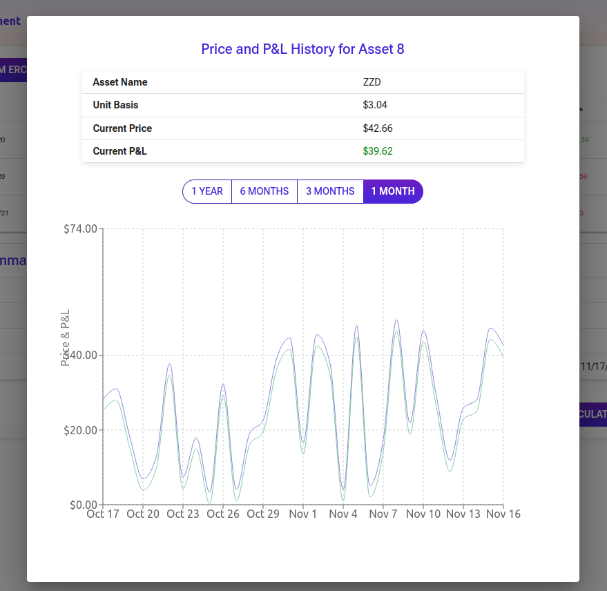

# Asset Management Lite UI

This is a Lite UI for the [Asset Management Example API](https://github.com/ACatThatPrograms/asset-management-api)
With it's respective respotistory [here]()

A (hopefully) live version of the API docs can be found [here](https://assetapi.acatthatprograms.com/api-docs)

Additionally a (should be) live version of the UI can be found [here](https://cats-asset-management.netlify.app/)

## Local Quick Start 

1. `pnpm i`
2. `pnpm dev`

To build use `pnpm build`

#### Known issues

Smart Contract address needs verified in custom assets, can cause issues if trying to add same address twice -- Needs caught in API

## Visual Guide And API Interation Explanation

### Login

A single login button will start-up the process to authenticate with Privy.IO

Once clicked, the login flow will pop up:

You will be prompted for a 2FA code to complete log in:

The login flow gets a JWT from Privy that is then sent to the Asset Management API to exchange for authorization token for the secured services on the Asset Management API

### Dashboard

The dashboard will initially be empty and needs populated by calling the back-end, unless you have already interacted with it.

The dashboard will also provide a portfolio summary at the bottom that updates with most calls to the API, though a manual triggers exists for getting the latest read.

The dashboard has the following buttons and their meanings:

"Add Random ERC20" - POST to `/assets` /w the post body filled out for adding an ERC20 Asset
"Add Random ERC721" - Similar to the above and calls `/assets` /w the post body filled out for adding an ERC721 Asset
"Add Custom Asset" - Pops a modal for filling out information for the post body and posts to `/assets` 
"Delete All Assets" - Deletes all of a user's asset inventory by calling DELETE `/assets`
"Mock 6 Months Of Values" - This is a development only function that backfills 6 months of pricing data to preview viewing historical data, posts to `/portfolio/backfill-price-data`
"Update Daily Price (Mock)" - This is a development route that is open that normally runs as a CRON job to get the daily price update, can be triggered manually by Posting `/assets/update-prices`
"Recalculate Portfolio" - A users portfolio value is updates manually by calling this function that POSTs `/portfolio/recalculate`  and then GET `/portfolio`

Behind the scenes a `portfolio` call is made during most updates, however it is adviseable to recalculate the portfolio after any large sequence of actions to get the latest and truest representation of the user portfolio.

Once the back-end is populated with assets a GET to `/assets` provides the dashboard with the user's asset and two actions available to them:

Trashcan Icon will delete entries by id via DELETE `/assets/:id`
The history button will show an assets performance over time by calling `/assets/:id/history`

Keep in mind that data needs to be mocked before historical assets can be viewed

Note that most pricing information is not available, only basis information in the ./doc-image/image above

Clicking the update prices, or mock 6 months button will generate that information, and it needs done anytime new assets have been added if they don't exist inside the server asset catalogue.

The above ./doc-image/image is after generating historical data, note that portfolio, and asset values are now populated, and the archive button can be clicked to view historical data now

### Asset History

Upon clicking the asset history button in the row of the asset you wish to view, a modal with information pertaining to it's historical performance will be visible

### Custom Asset Addition

The following modal will appear if Add Custom Asset is clicked, right now only Etherem is supported

The asset can be added or deleted by clicking the "Add Asset" or "Cancel" buttons respectively:

